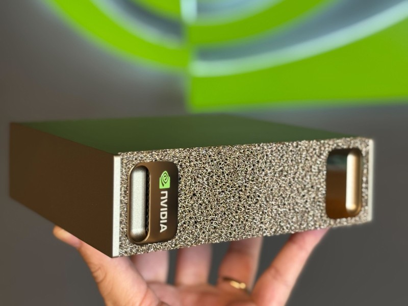

# GR00T Lerobot on DGX Spark playbook

The Dockerfile in this repo will build an image ready to train/inference gr00t via lerobot, on NVIDIA DGX Spark 🚀



### lerobot[gr00t]

This dockerfile will allow you to use the `lerobot[gr00t]` model.
Read more about it on Huggingface 🤗

- [Huggingface documenation](https://huggingface.co/docs/lerobot/groot)
- [NVIDIA blog post](https://huggingface.co/blog/nvidia/nvidia-isaac-gr00t-in-lerobot)

### Configuration

- Arch: __ARM__
- GPU: __GB10__
- CUDA: __13.1__
- torch: __2.9__
- flash-attn: __2.8.4__

Compiled binares for torch via [https://pypi.jetson-ai-lab.io/sbsa/cu130](https://pypi.jetson-ai-lab.io/sbsa/cu130)

### Instructions

On your DGX Spark, run:

```bash
git clone https://github.com/liorbenhorin/gr00t-lerobot-dgx-spark-docker
cd gr00t-lerobot-dgx-spark-docker
./start.sh
```
Note: First time will take ~45m to build due to `flash-attn`, so grab a huge coffee ☕

